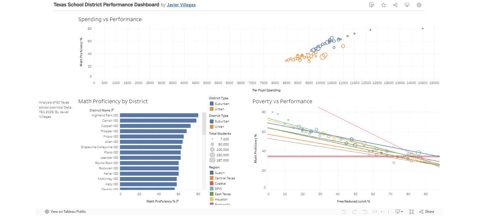

# Texas School District Performance Dashboard

## 📊 Overview

## 🎯 Objective
Analyze relationships between district spending, socioeconomic factors, and math proficiency across 50 Texas school districts.

## 🔎 Key Findings
- Poverty percentage is the strongest predictor of math proficiency.
- Spending has a weaker correlation compared to socioeconomic factors.
- Clear performance clustering exists by district type (Suburban vs Urban).
